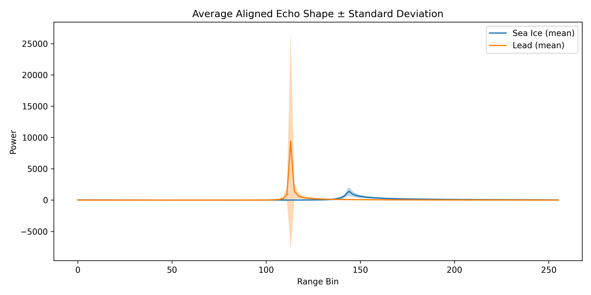
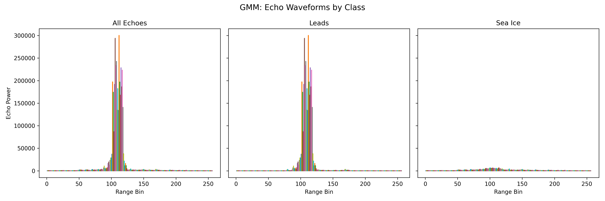
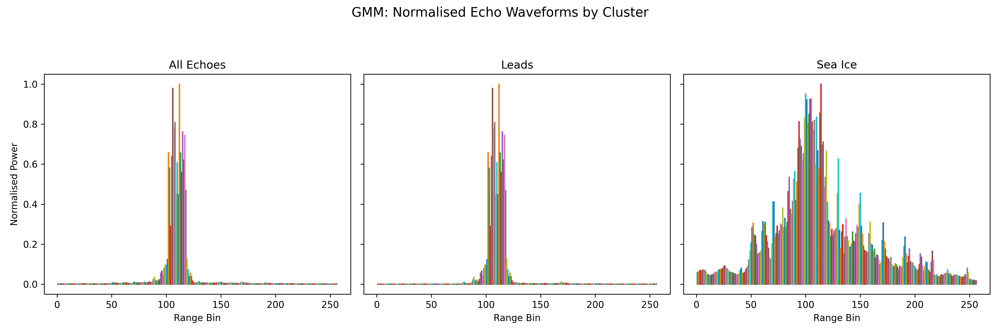
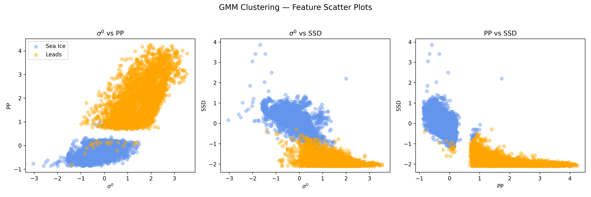
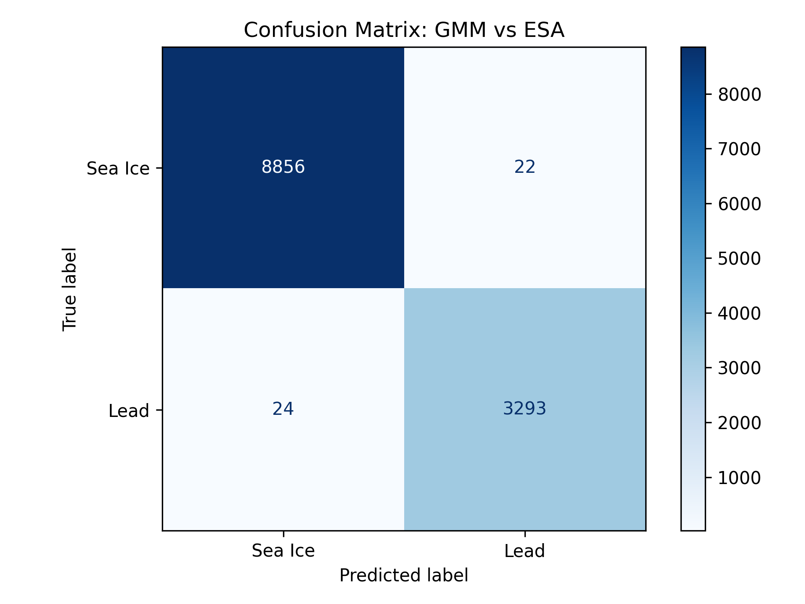

# Classifying Sea Ice and Leads from Sentinel‑3 Altimetry using GMM
This project tackles the task of **classifying radar echoes** from the Sentinel-3 satellite using **unsupervised learning**. The goal is to distinguish between **sea ice** and **leads** using waveform-derived features and validate our results against the ESA reference dataset.

---

## Objectives

- Apply **Gaussian Mixture Models (GMM)** to waveform data
- Classify echoes into **sea ice** and **leads**
- Compute and visualise:
  - The **mean** echo shape
  - The **standard deviation**
- Compare results to ESA labels using a **confusion matrix**

---

## How to Run

1. Open the `.ipynb` notebook in **Google Colab**
2. Mount your Google Drive
3. Update the `DATA_DIR` path to where your `.SEN3` data is stored
4. Run cells from top to bottom

---

## Results

### Echo Shape: Mean ± Standard Deviation

Below are the aligned waveform shapes for both classes, showing their average form and spread:

  

---

### All Echoes by Class (Raw)

Each subplot below shows all waveforms in each class (classified using GMM):

  

---

### Normalised Echoes by Class

For comparison, echoes were also normalised by their own maximum power:

  

---

### Feature Space (GMM Clustering)

The feature space used for clustering was based on:
- $\sigma^0$ (normalised radar backscatter)
- Pulse Peakiness (PP)
- Standard Deviation (SSD) of waveform power

  

---

### Confusion Matrix (vs ESA Ground Truth)

The GMM predictions were compared against ESA-provided labels.  
The results show **extremely high agreement**, with nearly perfect classification:

  

---

## Notes

- GMM outperformed expectations: The Gaussian Mixture Model was able to cluster the waveform data into sea ice and leads with extremely high accuracy, closely matching ESA's own classifications.

- Feature engineering was key: Just three derived features $\sigma^0$, pulse peakiness, and SSD were enough to separate the two classes clearly in feature space.

- Echo shape matters: Leads returned sharper, peakier waveforms with higher backscatter, while sea ice had broader, lower-energy echoes. This made clustering by waveform characteristics both intuitive and effective.

---

## References & Acknowledgements
This project was completed as part of the GEOL0069: AI for Earth Observation module at University College London (UCL).

Special thanks to Dr. Michel Tsamados, as well as Weibin Chen and Connor Nelson, for the original notebook and teaching materials that formed the basis for this work.

- Michel et al., *Chapter 1 – Unsupervised Learning Methods* available [Here](https://cpomucl.github.io/GEOL0069-AI4EO/Chapter1_Unsupervised_Learning_Methods_2.html)
- ESA Sentinel-3 Altimetry Data
- [Google Colab + GitHub Tutorial](https://medium.com/analytics-vidhya/how-to-use-google-colab-with-github-via-google-drive-68efb23a42d)

